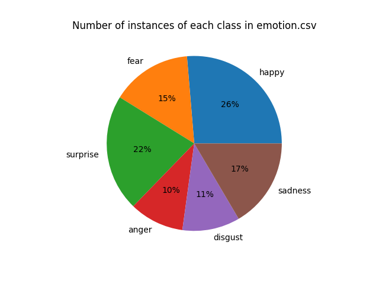

# Facial Emotion Classification

## Alignement : todo

## Class Imbalance : 

When exploring the data and it's associated statistical attributes, we can notice that the number of instances for each class is different, and, rather unequal. We're facing one of the most notorious problem in data engineering and data preprocessing : class imbalance.

Class imbalance is a situation in a classification problem where the classes that are to be predicted are not represented equally in the training dataset. In our context, it means that some facial expression classes (e.g., "fear," "disgust,", "anger" and "sadness") have a significantly lower proportion of samples compared to other classes (e.g., "happy" and "surprise"). This imbalance can be a problem because machine learning models may become biased toward the majority class, leading to poor performance on the minority classes.

There are multiple techniques to address this problem such as :
- **Resampling**
    -   **Oversampling** : Increase the number of samples in the minority class by duplicating existing samples or generating synthetic samples
    - **Undersmapling** : Decrease the number of samples in the majority class by randomly removing some samples.

- **Weighted Loss**
    - Adjust the loss function of our machine learning model to give more weight to the minority class. Many machine learning frameworks allow you to assign different weights to classes when training the model (eg. **class_weight** parameter in classifiers such as RF, SVM, SVC or **multiplying the loss by class weights** with tensorflow and **sparse_categorical_crossentropy** ...)
- **Stratified Sampling**
    - When splitting our data into training and testing sets, we can use **stratified sampling** to ensure that both sets maintain the same class distribution as the original dataset (parameter **stratify=y** when using the **train_test_split** function.)

